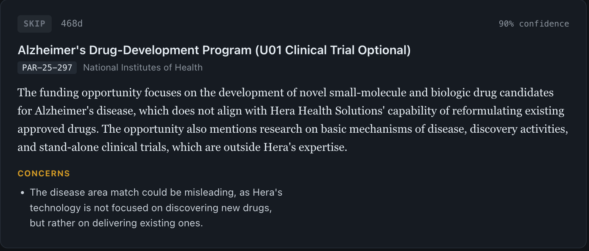

# agent-core

An automated agent that reads federal funding announcements and reasons about
whether they fit a specific research program — and, more usefully, explains why
most of them don't.

Tracking tools tell you what exists. This tells you what to ignore, with a
reason you can audit.



---

## What it does

Two subjects, run from the same codebase against different capability profiles:

| | Small business (drug delivery) | Individual researcher (neurometabolism) |
|---|---|---|
| Opportunities tracked | 526 | 370 |
| Passed the structured relevance gate | 14 | 110 |
| Assessed by the reasoning layer | 10 | 96 |
| Judged worth pursuing | 1 | 4 |

Most of the corpus is removed before a single token is spent. Of what reaches
the reasoning layer, the large majority is rejected — each with a written
rationale citing the specific mismatch.

The rejections are the product. An example, verbatim from a stored assessment:

> The funding opportunity focuses on natural products, such as botanicals,
> dietary supplements, and probiotics, which does not align with [the
> organization's] capability of developing a drug delivery platform for existing
> approved drugs. [...] The specific match on 'clinical trial' is a trap, as
> [the organization] is a platform licensor, not a sponsor running trials.

That announcement matched on keywords. A tracker would have surfaced it. The
agent identified the match as misleading and said why.

---

## How it works

```
poll      →  query grants.gov on a keyword set derived from the profile
fetch     →  pull full solicitation text for anything missing a description
shortlist →  structured filter: relevance, deadline viability, agency scope
              (no tokens — this is where most of the corpus is removed)
assess    →  LLM reasons each survivor against a capability profile, producing
              a verdict, confidence, rationale, and cited evidence
briefs    →  for pursue-worthy items, extract eligibility, budget, deadlines,
              and scope from the announcement text, with source links
dashboard →  static HTML, rebuilt each run
```

Runs unattended once a day via `launchd`. A DNS preflight handles the case where
the machine wakes from sleep before the network is up — without it, one wake-time
run spent 39 minutes in retry backoff against an unresolvable host.

Grants.gov is the only source. As of October 2025 it is the single official
posting point for NIH funding opportunities; the NIH Guide now carries policy
notices rather than announcements.

### Design decisions worth naming

**One markdown document defines a client.** The capability profile is a
versioned, human-editable markdown file. Search keywords, relevance terms, trap
terms, and eligibility rules are all parsed or interpolated from it. Onboarding a
new subject means writing a document, not changing code.

**Trap terms are the differentiator.** A profile declares terms that *look* like
matches but aren't — `clinical trial`, for an organization that licenses a
platform rather than sponsoring trials. This is what lets the agent overrule a
keyword hit with a stated reason instead of surfacing it.

**Eligibility rules live in the profile, not the prompt.** A small business is
disqualified by prior-award requirements; an individual postdoc is disqualified
by career stage. These are incompatible rules, so they travel with the client
rather than accumulating in a shared prompt.

**Assessments are keyed to a profile version.** Editing the profile and bumping
the version triggers re-assessment; assessments from superseded versions are
pruned. Every verdict is traceable to the exact profile text that produced it.

**Verdicts are three-way.** `pursue`, `maybe`, and `skip`. A `maybe` means a
specific unresolved question exists, and the rationale names it.

**Structured filtering happens before the model.** The expensive layer only sees
what survived the deterministic gate.

---

## Evaluation

The eval harness replays labeled cases and reports three outcomes: correct
verdict with clean reasoning, wrong verdict, and **weak** — correct verdict
reached by wrong reasoning.

Current state, and it is not flattering: **3 of 4 runnable cases clean, 1 wrong
verdict, 7 of 11 labeled cases no longer runnable.** The missing cases are
opportunities that have been pruned from the database since they were labeled,
which means the eval set silently shrank. Fixing that — storing case text
alongside the label so cases survive pruning — is the next piece of work.

The third outcome category exists because of a specific failure. A profile line
stating the researcher had no clinical-trial infrastructure caused the reasoner
to reject eleven K-series and F-series announcements on the grounds that their
titles said "Independent Clinical Trial Required" — a designation that describes
what a candidate's proposed project may include, not infrastructure the
applicant must already possess. Every one of those verdicts was defensible on
other grounds, so a verdict-only eval scored them as passes. Scoping that profile
line reduced the failure from eleven cases to two and surfaced a pursue-worthy
opportunity that had been suppressed.

That is the argument for the harness: the reasoning degraded while the score
stayed clean.

---

## Stack

| Layer | Choice |
|---|---|
| Language | Python 3.14 |
| State | SQLite |
| Embeddings | Ollama (`all-minilm`, 384-dim), local |
| Vector store | Pinecone |
| Reasoning | Groq (`openai/gpt-oss-120b`) |
| Scheduling | `launchd` (macOS) |
| Output | static HTML |

The reasoning model is not stable infrastructure. The previous model was
deprecated mid-project with no notice, and the swap was detected by a 404 rather
than by any monitoring. The Pinecone index is 384-dimensional, so any embedding
replacement must match that dimensionality or the index must be rebuilt.

---

## Setup

```bash
git clone <repo>
cd agent-core
python -m venv venv && source venv/bin/activate
pip install -r requirements.txt
```

Copy the environment template and fill in your own keys:

```bash
cp .env.example .env
```

```
GROQ_API_KEY=          # console.groq.com
PINECONE_API_KEY=      # app.pinecone.io
PINECONE_INDEX=        # must be a 384-dimensional index
LLM_MODEL=openai/gpt-oss-120b
DB_PATH=agent.db
DASHBOARD_OUT=dashboard.html
CLIENT=hera
```

Ollama must be running locally with the embedding model pulled:

```bash
ollama pull all-minilm
```

Initialize the database and load a profile:

```bash
python -m app.db.store
PYTHONPATH=. python scripts/new_profile_version.py profiles/<profile>.md
```

Run:

```bash
./run.sh              # default subject
./run.sh <subject>    # uses agent-<subject>.db and dashboard-<subject>.html
```

The wrapper sets `CLIENT`, `DB_PATH`, `DASHBOARD_OUT`, and `PYTHONPATH`
together. Setting them individually is possible and is how you get a run that
silently writes to the wrong database.

---

## Repository layout

```
app/
  pipeline.py        orchestration; each stage isolated, timed, and fail-safe
  sources/           grants.gov client
  profile/
    load.py          parses vocabulary and terms out of the profile markdown
    generate.py      profile authoring
  reason/
    filter.py        structured shortlist (no tokens)
    assess.py        the reasoning layer and its prompt
  detail/
    fetch.py         full announcement retrieval
    brief.py         eligibility / budget / deadline / scope extraction
    cache.py         brief caching
  evals/
    reasoner.py      replays labeled cases; reports clean / wrong / weak
  db/
    schema.sql       full schema; builds a working database from scratch
    store.py         connection and initialization
  dashboard/
    build.py         static HTML generation
scripts/             one-shot anchored patch scripts, kept as a change record
profiles/            versioned capability profiles, as markdown
evals/               labeled cases
```

---

## Status and limitations

- One capability profile per database. Multiple subjects are supported by
  separate database files rather than tenancy within one.
- One of eleven labeled cases is unstable across runs. In stored-verdict mode,
  cases that have fallen out of the current shortlist show as unassessed; use
  `--live` to replay them against the model directly.
- Vocabulary and trap terms are hand-written per subject. The system does not
  expand or suggest terms, so a term nobody thinks to write does not exist to the
  system.
- Two known cases remain where a correct verdict is reached by incorrect
  reasoning about clinical-trial designations.
- Deadline extraction from announcement tables is imperfect. Extracted deadlines
  are flagged for verification against the source rather than silently trusted.
- Non-federal funders — private foundations, disease-specific organizations —
  are not polled.

---

## Scope

Built as an independent project. All inputs are publicly available: federal
funding announcements and hand-written capability profiles describing publicly
known capabilities. No proprietary or internal material from any organization is
used or stored.
